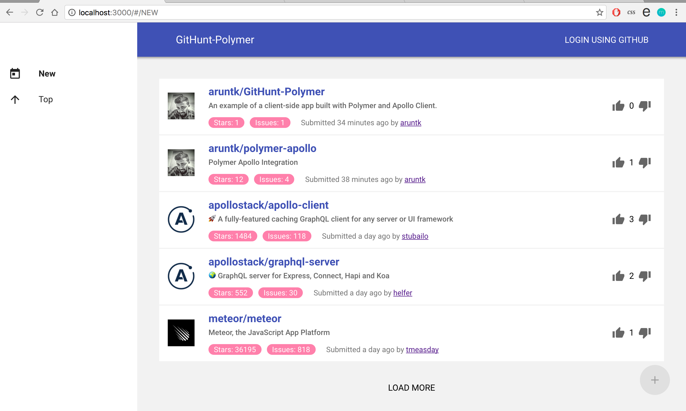
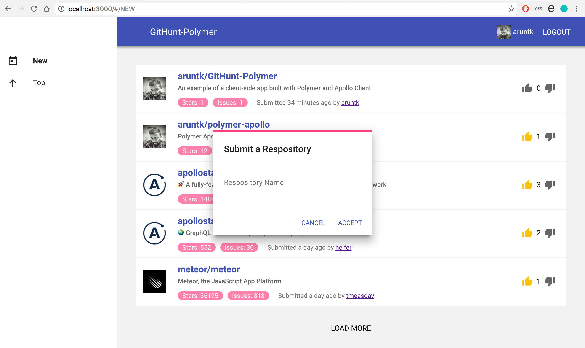
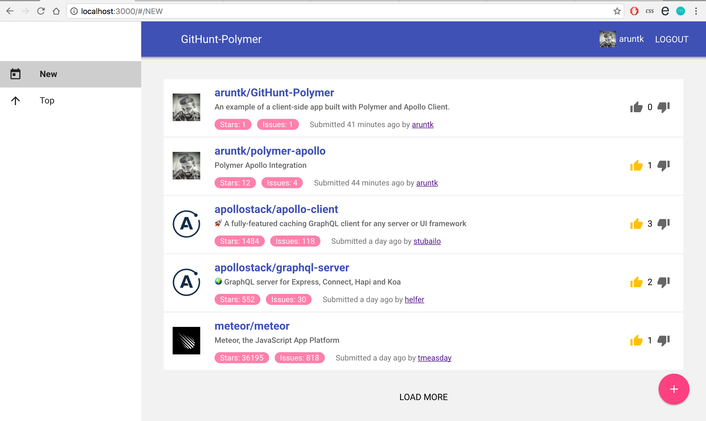

# GitHunt Polymer

An example of a client-side app built with Polymer and Apollo Client.

Polymer-Apollo package : https://github.com/aruntk/polymer-apollo

Please submit a pull request if you see anything that can be improved!

## Running the app

### 1. Clone and run the GitHunt API

This repository is only the Polymer frontend. Run the [GitHunt API](https://github.com/apollostack/GitHunt-API) first. (This is temporary, until we have a permanently hosted demo server.)

### 2. Install Node/npm

Make sure you have Node.js installed (the app has been tested with Node `4.4.5` and `5.3.0`)


### 3. Clone and install dependencies

```
git clone https://github.com/aruntk/GitHunt-Polymer.git
cd GitHunt-Polymer
npm install
```


### 4. Run the app

```
npm start
```

- Open the client at http://localhost:3000
- Click "Log in with GitHub" in the upper right corner
- You'll be presented with the seed items in the app



#### Submit a Repo
Click the fab with plus icon in the bottom right corner and add repo with the username/repo-name pattern.



#### New Item
Review the new item, up vote it and visit the repo via the link.   

